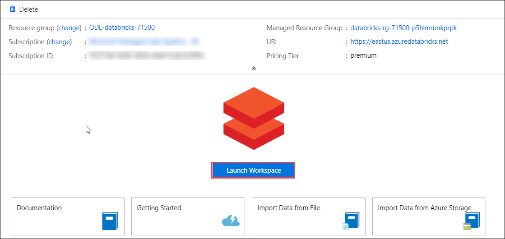
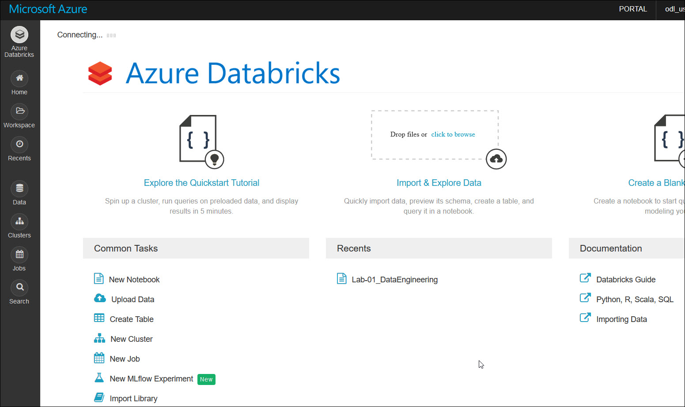

# Azure Databricks Labs

**Azure Databricks** is an Apache Spark-based big data analytics and machine learning framework optimized for the Microsoft Azure Cloud.
Databricks is integrated with Azure to provide one-click setup, streamlined workflows, and an interactive workspace that enables collaboration between data scientists, data engineers, and business analysts.

This tutorial consists of six labs that are designed to help you to understand how to use Azure Databricks for different use cases, including:

* Analysis of structured and unstructured data.
* Analysis of streaming data.
* Machine Learning.

The six labs are implemented as six independent Azure Databricks notebooks as described below. You can find the Azure Databricks notebooks in the Databricks workspace.

#### Lab-01 Data Engineering:

This tutorial helps you understand how to use Azure Databricks Spark to prepare raw data for analytics.

#### Lab-02 SparkSQL & Performance Optimization

This tutorial help you to understand the capabilities and features of **Spark SQL** and the various performance options provided by Azure Databricks.

#### Lab-03 Machine Learning

This tutorial helps you understand the capabilities and features of **Azure Spark MLlib** for machine learning. It shows how to construct the end-to-end process for building and refining a machine learning model.
	
#### Lab-04 Real-time Stream Analytics
		
This tutorial helps you understand Azure Databricks **Spark Structured Streaming**. It shows the end-to-end process starting with data ingestion into a Azure Databricks cluster in near real-time, through analysis of the the streaming data and integration with machine learning.

#### Lab-05 Databricks Delta
	 
This tutorial is helps you understand the features and capabilities of **Azure Databricks Delta**. Azure Databricks Delta is a next-generation unified analytics engine built on Apache Spark™. It provides ACID transactions, optimized layouts and indexes to enable big data use cases, from batch and streaming ingests, fast interactive queries to machine learning.
		
#### Lab-06: Data orchestration using Azure Data Factory
	
This tutorial helps you understand how **Azure Data Factory** (ADF) can be used with Azure Databricks, to create and automate piplines.

# Getting Started

Follow these instruction to set up the lab environment for the lab.

## Step 1: Verify the pre-deployed resources.

1. **Login** to [Azure portal](https://portal.azure.com) using the credentials provided in the environment details page. You will be having access to one resource group. 
2. **Open** the resource group and you can find a **Databricks workspace** already deployed.  
<kbd></kbd>  
3. Go to the Azure Databricks workspace, and then click on **Launch Workspace**.  
<kbd></kbd>  
4. You are now inside your Databricks workspace.  
<kbd></kbd>

## Step 6: Attach the Notebook to your cluster.

1. **Open** the Databricks Workspace. 
2. Click on **Clusters** tab to view the available Databricks Clusters. **Start** the cluster if it is in terminated state.  
<kbd></kbd>  
3. Now let's **Click** on the **Workspace** tab and open the folder named **Shared**, where you can find multiple notebooks. Open the first notebook.  
<kbd></kbd>  
4. Click on **`detached`** written on the top-left corner, and you'll see a list of active clusters.  
<kbd></kbd>  
5. **Attach** your notebook to a running cluster. A green icon shall appear on top, meaning our notebook is now attached to our cluster and is ready to be executed. Now you need to follow the instructions specified in each of the Notebooks.

### Your Databricks Environment is ready now and you can proceed with the labs.
1. **Open** the Databricks Workspace. 
2. **Click** on the **Workspace** tab, open the folder named **Shared**, where you can find multiple Notebooks. **Open** the first notebook named **Lab-01_DataEngineering**.  
<kbd></kbd>  
3. **Attach** the cluster in to this Notebook, if you haven't attached it yet. 
4. Follow the instructions in the notebook to continue with the lab. To run the cells in the Notebook, **Click** on the **Play** button in the top right corner of the cell and then **Click** on **Run Cell**  
<kbd></kbd> 
