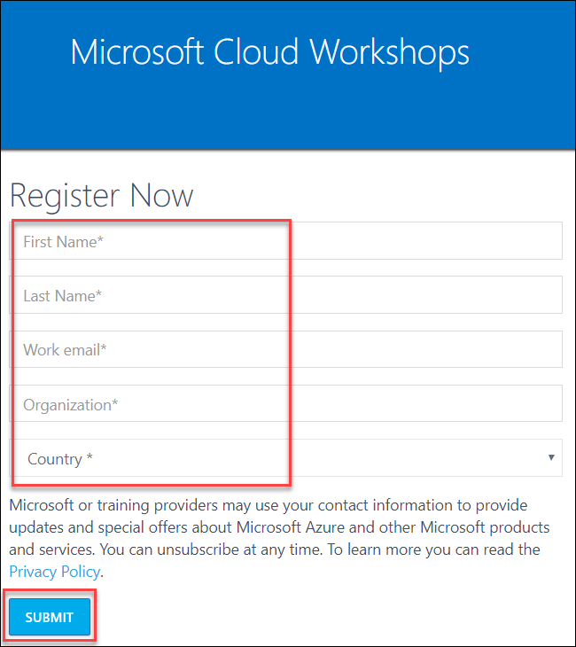
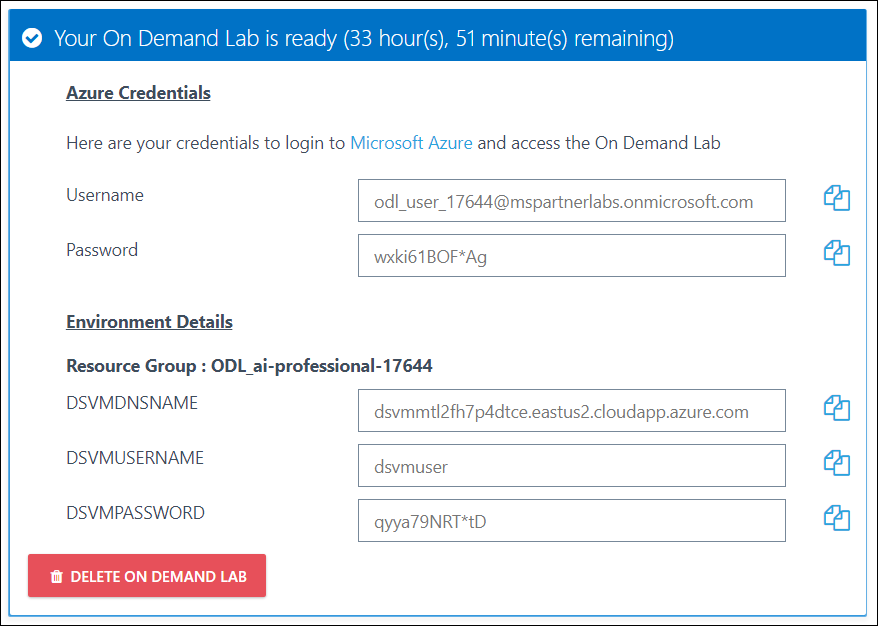

# Introduction

Professional AI Developers is a two day workshop lead by Microsoft or Microsoft partners. These two days focus on hands-on activities that develop proficiency in AI-oriented workflows leveraging Azure Machine Learning Workbench and Services, the Team Data Science Process, Visual Studio Team Services, and Azure Container Services. You can find details about the worksohp [here](https://github.com/Azure/LearnAI-Bootcamp/blob/master/proaidev_bootcamp.md).

# Sign-up for Workshop Environment

To make it easier for you to work on the labs, you are provided with pre-provisioned Azure environment. You will receive sign-up link for the lab environment from your instructor. 

* Register for the lab environment by providing your information and clicking on **Submit** button.
 

* On the next page, click the **Launch Lab** button.
  
 
* Wait for the lab environment to be provisioned. Sometimes this can take upto **10 minutes**. Once environment provisioning is complete, you will receive details in email as well as in the browser.
 
 
 > Note: Lab environment is enabled only for specific duration or workshop end time - whichever is earlier. At the end of the allowed time, environment will be self-destructed. Also, for multi-day workshops, all virtual machines will be shutdown at 7 PM local time and start at 8AM local time.

# Verify the pre-provisioned Environment

## Verify Azure Access

Open a browser instance in private or incognito mode and login to [Microsoft Azure Portal](https://portal.azure.com) using the credentials provided.

> Note: You might have an existing Azure Credential. For the pre-provisioned environment, new Microsoft Azure environment is provisioned and new AAD user is created for you. To prevent conflict with your existing accounts, it is advised to use In Private mode of IE / IE Edge or Incognito mode of Chrome browser.

## Verify Virtual Machine

You are provided a [Data Science Virtual Machine - Windows 2016](https://azuremarketplace.microsoft.com/en-us/marketplace/apps/microsoft-ads.windows-data-science-vm) with additional softwares configured. FQDN of the virtual machine and administrator credentials are provided in the lab details page. You can remote into the virutal machine using the provided credentials and validate the following:

> Note: DSVM is provisioned in the resource group, in which you have access. Once you login to Microsoft Azure Portal, you can navigate to this VM to find more details.

* **Docker for Windows Community Edition** is installed on the virtual machine. You should see the icon on **Desktop** or else, you can find / search it from the **Start Menu**

  * Start **Docker for Windows** by clicking on the icon.
  
  * Wait for the Welcome message to show up, which will also say `Docker is now up and running!`
  
  * Open a command prompt and run the command `docker run docker/whalesay cowsay "Hello"`
  
  * Above command should run successfully and show you the output.

* **Azure Machine Learning Workbench** installer is downloaded and kept in **Desktop**.

## Install Azure Machine Learning Workbench

Launch msi provided in **Desktop** and follow the instructions to install **Azure Machine Learning Workbench** on the virtual machine. Please note that it might take 45 minutes to an hour sometimes for installation.

# Initial setup for lab environment

# Known Issues

* Docker for Windows is not starting

> Possible Solutions:
  1. Check and ensure if Docker is running in 'Linux Containers' mode
  2. Virtual Machine may not be running in a nested-virtualization supported family. Check if it is D4_v3 or D4S_v3.

* Failure while trying to create NC6 virtual machines
> Possible Solutions: Mostly this could be quota issue. You can delete the current VM, and try to create another VM in South Central US, with NV6 size. If you are provided user@microsofthol.onmicrosoft.com account, then you should try NV6 in South Central US, irrespective of the resource group region.

# Notes to Instructors / Proctors

* Linux Ubuntu DSVM Virtual Machine Creation

If your users are provided with user@microsofthol.onmicrosoft.com account, they should create Linux Ubuntu DSVM in South Central US with NV6 compute family. Otherwise, they will get error due to quota issues.

# Help and Support

If you require any help during the workshop, please reach out to the instructor / proctors.

