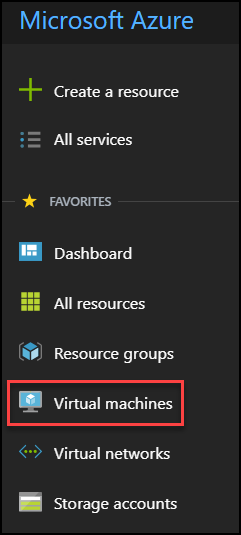
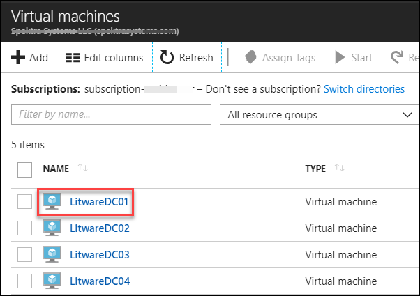
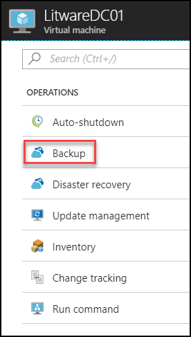
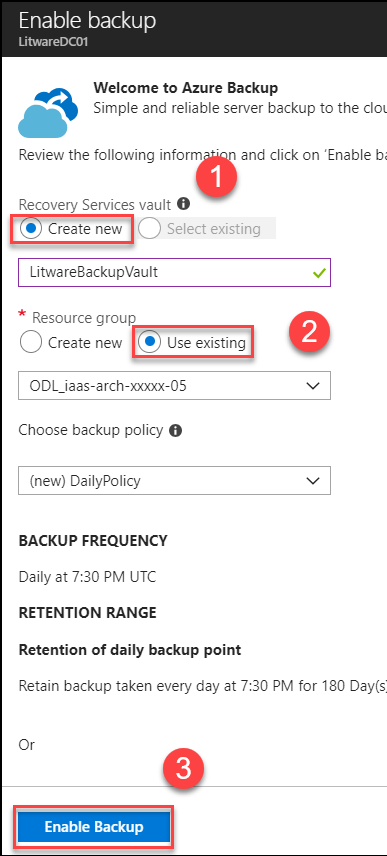

# Introduction

This is a supplement guide to ‘Microsoft Cloud Workshop - [Building a Resilient IaaS Architecture](https://github.com/Microsoft/MCW-Building-a-resilient-IaaS-architecture/blob/master/Hands-on%20lab/HOL%20step-by%20step%20-%20Building%20a%20resilient%20IaaS%20architecture.md)’, to be used when you are delivering a hands-on-lab session using Cloud Labs AI platform from Spektra Systems. If you have any questions, please reach out to cloudlabs-support@spektrasystems.com

Building a Resilient IaaS architecture is a one day workshop lead by Microsoft or Microsoft partners. The student will assist a large organization in evaluating their current infrastructure deployments in Azure, and help identify single points of failure. Attention will be given to making the customer's current deployments more resilient and communicating best practices to ensure future deployments will follow best practices.
Attendees will be better able to design resilient applications in Azure, for high availability and disaster recovery. Specific attention will be given to: 

*	The use of availability sets
*	The use of Managed Disks
*	Design principles when provisioning storage to VMs
*	Effective employment of Azure Backup to provide point-in-time recovery

# Verify the pre-provisioned Environment

1. Launch a browser using incognite or in-private mode, and navigate to https://portal.azure.com. Once prompted, login with the Microsoft Azure credentials you received.   

2. Once you are logged in to the portal, navigate to Resource Groups. 
 
3. Note that you have access to eight resource groups. User need to deploy other resources in Pre-created RGs.

4. Navigate to the resource group **OPSLABRG-xxxxx** and view the already existing resources such as LABVM Virtual Machine,         Disk, etc

5.Using a remote desktop client, open a Remote Desktop Session into the LABVM using the labvmdnsname and credentials you received
   Now check if exercise files for the hands-on lab are already downloaded in C:\HOL

## Verify Azure Access

Open a browser instance in private or incognito mode and login to [Microsoft Azure Portal](https://portal.azure.com) using the credentials provided.

> Note: You might have an existing Azure Credential. For the pre-provisioned environment, new Microsoft Azure environment is provisioned and new AAD user is created for you. To prevent conflict with your existing accounts, it is advised to use In Private mode of IE / IE Edge or Incognito mode of Chrome browser.

## Verify Virtual Machine

You are provided a Visual Studio Community 2017 on Windows Server 2016 (x64)Microsoft.FQDN of the virtual machine and administrator credentials are provided in the lab details page. You can remote into the virutal machine using the provided credentials.

> Note: LAB VM is provisioned in the resource group **OPSLABRG-xxxxx**. Once you login to Microsoft Azure Portal, you can navigate to this VM to find more details.

# Known Issues

* In **Exercise-2** **Task 2** While creating **Windows Server 2016 DataCenter VMs**, you may not see the option for **Enable Backup** so you can configure **Backup** after the deployment of VMs. In this case deploy the all four VMs first and then configure the Backup.

 Please follow these steps to configure **Backup** :

* **Step 1.** Click on **Virtual Machines** 

  

* **Step 2.**  Select **LitwareDC01** VM which is created by you.

  

* **Step 3.** Click on **Backup** under Operations menu.

  

* **Step 4.** Click on create new RecoveryServiceVault enter name **LitwareBackupVault** and Select Existing RG **ODL_iaas-arch-xxxxx-05** and then click on **Enable backup**.

 <kbd></kbd>

* > **Repeat same Steps from  2 to 4** for **LitwareDC02** VM and select existing RecoveryServiceVault **LitwareBackupVault**.

 

* > **Repeat same Steps from  2 to 4** for **LitwareDC03**, now Create new RecoveryServiceVault enter name **LitwareBackupVault2** and Select existing RG **ODL_iaas-arch-xxxxx-07**.
 
 
 
* > **Also repeat same Steps from  2 to 4** for **LitwareDC04** and select existing RecoveryServiceVault  **LitwareBackupVault2**.

 

# Notes to Instructors / Proctors

# Help and Support

If you require any help during the workshop, please reach out to the instructor / proctors. Instructors / proctors might escalate the issue to remote support team, at that time, please pass on your AAD User ID (aad_user_xyz), so that it is easier to look up your environment.

  
